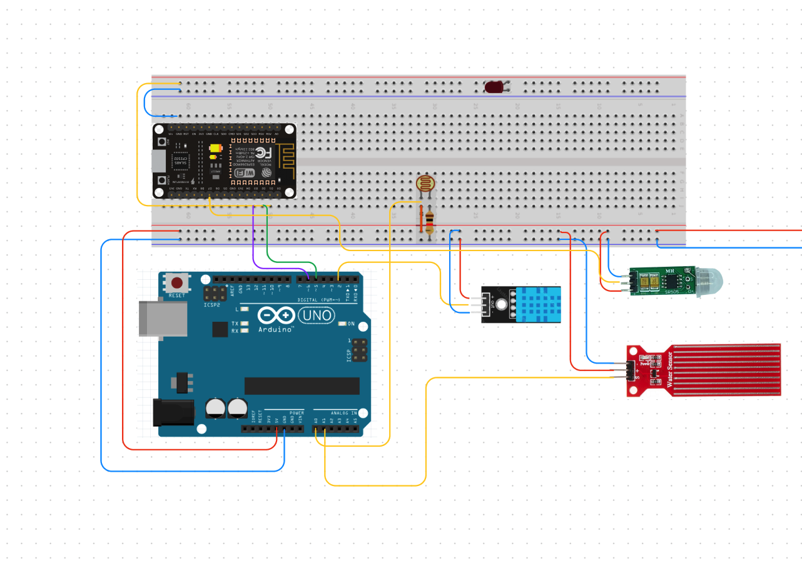
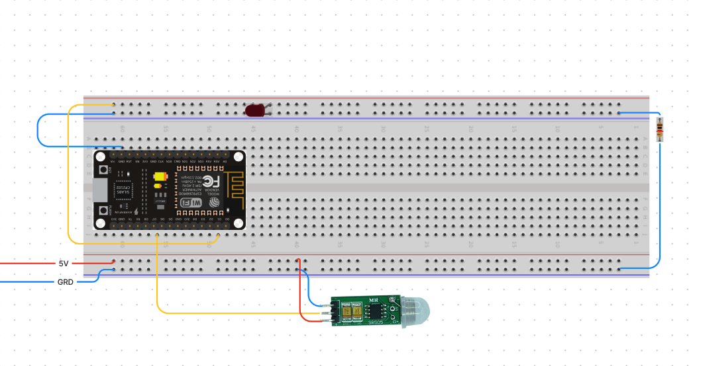

## Course Project: Smart street light system

# Topic: An application to control smart lights. 💡💡💡

## Group 5: Octopuses 🐙

## 1. Project details:

**We want to build a smart street ✌️ light system that includes the following criteria:**

1. The system will turn on the street lights at a moderate level (to save electricity ⚡️)
2. The light will be more bright 🌟 when there is a vehicle on the road or when it rains.
3. The system also takes context information such as temperature and humidity on the road and uploads it to the cloud system.
4. Light poles 🚏 communicate with each other wirelessly.
5. We also use solar energy in day to reduce consumption capacity. 🌱

## 2. Circuit diagram

### 2.1 Master



I used a Arduino UNO to read enviroment infomation. The information include: light, rain, humidity and temperature of street. 
(I must to use UNO because ESP8266 can't read many analog signa).

All infomation from UNO was transmit to ESP8266 by custom TX-RX (D5,D6)
ESP8266 will reciept information in Json form. Thus I'll use that information and signal from Motion sensor to turn the light in condition.

The last, all information sended on broker acrossding MQTT method.

### 2.2 Child


All child circuit subcriber the topic on broker. So they can know messenge of Master. Similar to ESP8266 on Master they will read motion signal and turn the light in codition.
(Mission of child is only control the light and don't send anything else)

## 3. System architeture

In this project, I used MQTT method to communicate between devices and device to server. Broker i was use is HiveMQ. 

## 4. File:
All my code in code folder include: Uno, Node, Child and demo.py

- Uno and Node is code of Master curcuit. 
- Child for Child circuit.
- Demo.py is application

## 5. How to run?
1. First one, You need to clone my repo.
```
https://github.com/RC-Sho0/Smart-street-light-control-system--IoT.git
```

2. Push source code for each circuit.
**Attention ⛔️**: In Node.ino and Child.ino you need to replace 
```
const char* ssid = {Your WIFI};         
const char* password = "Your WIFI password"; 
```

3. Connect the wires as shown on the diagram.

4. Plug power and run application
```
streamlit run demo.py
```


---------------
**Code by Sho0**

*Hope you guys can refer to this project*


